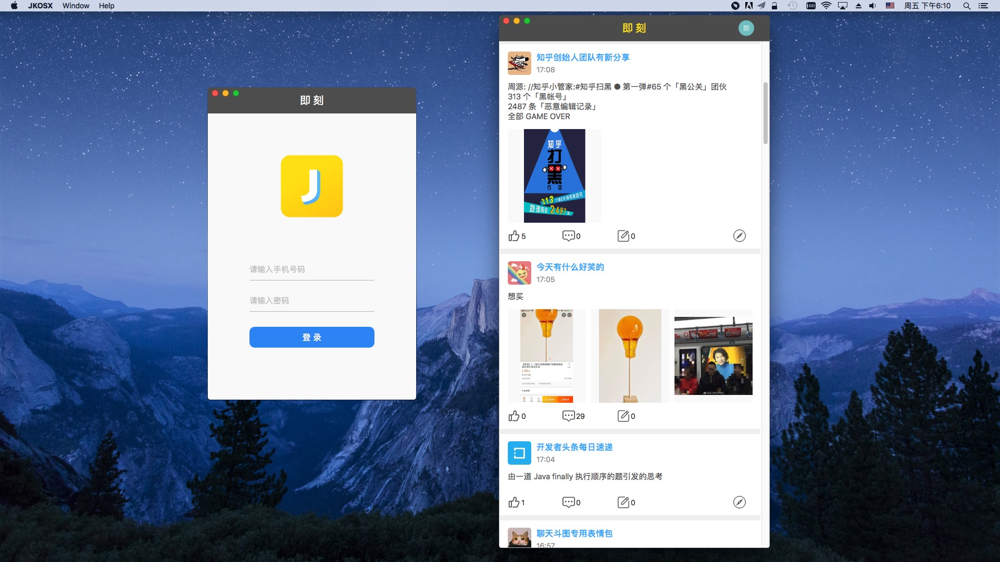
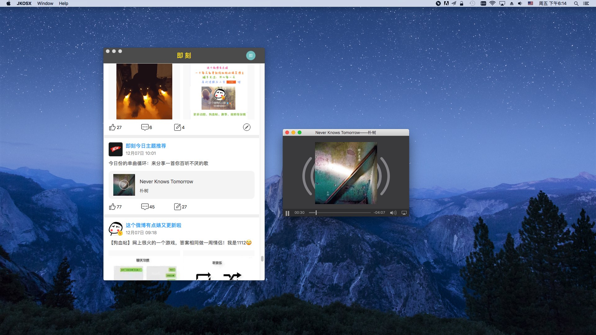

## 欢迎试用 即刻 MacOS客户端

非常喜欢即刻这个App，即兴为即刻这个App写了一个Mac平台的客户端。

目前客户端功能很简陋，只有以下功能：

- 单一列表，来自用户的关注内容；
- 可点赞、评论、转发到自己动态；
- 可查看图片、音频、视频多媒体；
- 访问外部链接；
- 新Feed推送通知。

之后有时间，会逐步同步完善App的功能。

如果您发现有什么Bug，请随时[联系我](mail2chensh@gmail.com).

或者提issue到[这里](https://github.com/mail2chensh/jike_macos/issues)。

